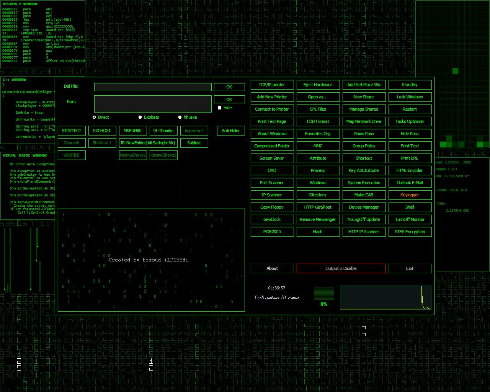



## WinMan \(Security \- Utility\)

### Description

This source code contains some codes from this site (my www.Planet-source-code.com) and others... this code has been written in short time... so there are too many problems in it that I didn't for example CMD form is not good as it must be!

also supports:

some of encodings like MD5, SHA (160,512,1024)

some of APIs, IP (with HTTP) and Port scanner

work on HTTP protocol (GET/POST)

NTFS Encoding (with Cipher)

Geo clock

Window manager

Process manager

some removals for NTDETECT, SVCHOST, MSFUN80, IR-Thumb, IR-NewFolder[Ali Sadeghi], Saldost.
 
### More Info
 
To see the main form, in matrix type "ilderemi main" and press Enter.

To see the console form, in matrix type "ilderemi cmd" and press Enter.

VB needs more than 1GB RAM to compile it faster...

My Settings:

CPU Type:DualCore Intel Core 2 Duo E7300

Motherboard Name:Intel Nobletown DG43NB

RAM:2*2GB (DDR2-800 DDR2 SDRAM)

             |
---                |---
**Submitted On**   |2008-11-27 12:22:20
**By**             |[iLDEREMi](https://github.com/Planet-Source-Code/PSCIndex/blob/master/ByAuthor/ilderemi.md)
**Level**          |Advanced
**User Rating**    |4.5 (18 globes from 4 users)
**Compatibility**  |VB 6\.0
**Category**       |[Complete Applications](https://github.com/Planet-Source-Code/PSCIndex/blob/master/ByCategory/complete-applications__1-27.md)
**World**          |[Visual Basic](https://github.com/Planet-Source-Code/PSCIndex/blob/master/ByWorld/visual-basic.md)
**Archive File**   |[WinMan\_\(Se21381812252008\.zip](https://github.com/Planet-Source-Code/ilderemi-winman-security-utility__1-71567/archive/master.zip)

